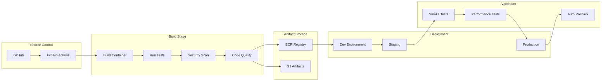
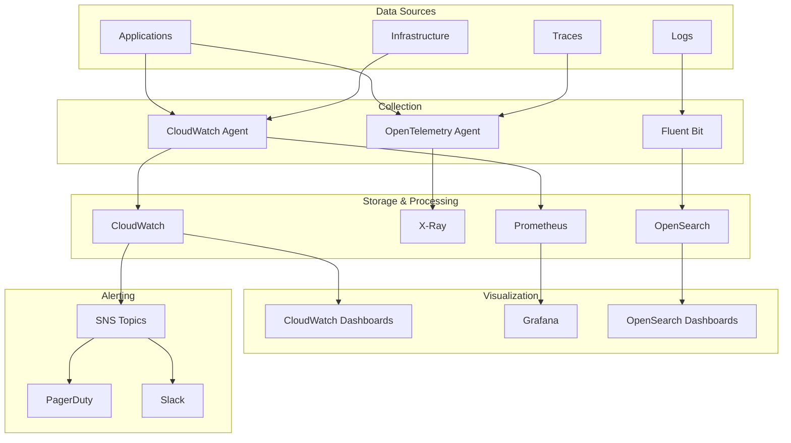

# DevOps Infrastructure Plan for User Behavior Data Pipeline

## 1. Cloud Infrastructure Architecture

### Multi-Region Architecture Design

```mermaid
graph TB
    subgraph "Primary Region (us-east-1)"
        subgraph "Ingestion Layer"
            ALB[Application Load Balancer]
            AG[API Gateway]
            KDS[Kinesis Data Streams]
        end
        
        subgraph "Processing Layer"
            KDA[Kinesis Data Analytics]
            Lambda[Lambda Functions]
            ECS[ECS Fargate Cluster]
            EMR[EMR Spark Cluster]
        end
        
        subgraph "Storage Layer"
            S3P[S3 Primary Bucket]
            DDB[DynamoDB Global Table]
            RDS[RDS PostgreSQL/TimescaleDB]
            RS[Redshift Cluster]
        end
        
        subgraph "Caching Layer"
            EC[ElastiCache Redis]
            CF[CloudFront CDN]
        end
    end
    
    subgraph "DR Region (us-west-2)"
        S3DR[S3 DR Bucket]
        DDBDR[DynamoDB Global Table]
        RSDR[Redshift DR Cluster]
    end
    
    subgraph "Edge Locations"
        CFE[CloudFront Edge]
        LE[Lambda@Edge]
    end
    
    Users --> CFE
    CFE --> ALB
    ALB --> AG
    AG --> KDS
    KDS --> KDA
    KDS --> Lambda
    Lambda --> DDB
    KDA --> S3P
    S3P --> EMR
    EMR --> RS
    S3P -.-> S3DR
    DDB -.-> DDBDR
    RS -.-> RSDR
```

### Infrastructure Components

#### Network Architecture
```yaml
VPC Configuration:
  CIDR: 10.0.0.0/16
  Subnets:
    Public:
      - 10.0.1.0/24 (AZ-1a)
      - 10.0.2.0/24 (AZ-1b)
      - 10.0.3.0/24 (AZ-1c)
    Private:
      - 10.0.11.0/24 (AZ-1a)
      - 10.0.12.0/24 (AZ-1b)
      - 10.0.13.0/24 (AZ-1c)
    Data:
      - 10.0.21.0/24 (AZ-1a)
      - 10.0.22.0/24 (AZ-1b)
      - 10.0.23.0/24 (AZ-1c)
  
  Security Groups:
    - sg-web: HTTP/HTTPS ingress
    - sg-api: Internal API access
    - sg-data: Database access
    - sg-processing: EMR/Spark access
```

#### Compute Resources
```yaml
ECS Fargate:
  Services:
    - data-ingestion-api:
        CPU: 2 vCPU
        Memory: 4 GB
        DesiredCount: 6
        AutoScaling: 3-20 tasks
    
    - stream-processor:
        CPU: 4 vCPU
        Memory: 8 GB
        DesiredCount: 4
        AutoScaling: 2-10 tasks

Lambda Functions:
  - event-validator:
      Runtime: Python 3.11
      Memory: 512 MB
      Timeout: 60s
      ReservedConcurrency: 100
  
  - real-time-aggregator:
      Runtime: Python 3.11
      Memory: 1024 MB
      Timeout: 300s
      ReservedConcurrency: 50

EMR Cluster:
  Master:
    InstanceType: m5.xlarge
    Count: 1
  Core:
    InstanceType: m5.2xlarge
    Count: 3
    AutoScaling: 3-10 nodes
  Task:
    InstanceType: m5.xlarge
    SpotInstances: true
    TargetCapacity: 5
```

#### Storage Configuration
```yaml
S3 Buckets:
  Raw Events:
    Name: company-raw-events-prod
    Lifecycle:
      - StandardIA: 30 days
      - Glacier: 90 days
      - Deep Archive: 365 days
    Replication: Cross-region to us-west-2
  
  Processed Data:
    Name: company-processed-data-prod
    Lifecycle:
      - StandardIA: 60 days
      - Glacier: 180 days
    
DynamoDB:
  Tables:
    - real-time-events:
        PartitionKey: user_id
        SortKey: timestamp
        BillingMode: ON_DEMAND
        GlobalTable: [us-east-1, us-west-2]
        TTL: 7 days
    
    - user-sessions:
        PartitionKey: session_id
        BillingMode: PROVISIONED
        ReadCapacity: 500
        WriteCapacity: 1000
        AutoScaling: enabled

Redshift:
  Cluster:
    NodeType: ra3.4xlarge
    Nodes: 3
    EncryptionAtRest: true
    AutomatedSnapshots: 7 days
    CrossRegionSnapshots: us-west-2
```

### Infrastructure as Code

#### Terraform Module Structure
```
terraform/
├── environments/
│   ├── prod/
│   │   ├── main.tf
│   │   ├── variables.tf
│   │   └── terraform.tfvars
│   ├── staging/
│   └── dev/
├── modules/
│   ├── networking/
│   ├── compute/
│   ├── storage/
│   ├── streaming/
│   └── security/
└── global/
    ├── iam/
    └── route53/
```

## 2. CI/CD Pipeline

### Pipeline Architecture



### GitHub Actions Workflow

```yaml
# .github/workflows/data-pipeline-deploy.yml
name: Data Pipeline CI/CD

on:
  push:
    branches: [main, develop]
  pull_request:
    branches: [main]

env:
  AWS_REGION: us-east-1
  ECR_REPOSITORY: data-pipeline

jobs:
  test:
    runs-on: ubuntu-latest
    steps:
      - uses: actions/checkout@v3
      
      - name: Set up Python
        uses: actions/setup-python@v4
        with:
          python-version: '3.11'
      
      - name: Install dependencies
        run: |
          pip install -r requirements.txt
          pip install -r requirements-dev.txt
      
      - name: Run unit tests
        run: |
          pytest tests/unit --cov=src --cov-report=xml
      
      - name: Run integration tests
        run: |
          docker-compose up -d
          pytest tests/integration
          docker-compose down
      
      - name: SonarQube Scan
        uses: sonarsource/sonarqube-scan-action@master
        env:
          SONAR_TOKEN: ${{ secrets.SONAR_TOKEN }}
      
      - name: Security scan with Snyk
        uses: snyk/actions/python@master
        env:
          SNYK_TOKEN: ${{ secrets.SNYK_TOKEN }}

  build:
    needs: test
    runs-on: ubuntu-latest
    if: github.ref == 'refs/heads/main' || github.ref == 'refs/heads/develop'
    
    steps:
      - uses: actions/checkout@v3
      
      - name: Configure AWS credentials
        uses: aws-actions/configure-aws-credentials@v2
        with:
          aws-access-key-id: ${{ secrets.AWS_ACCESS_KEY_ID }}
          aws-secret-access-key: ${{ secrets.AWS_SECRET_ACCESS_KEY }}
          aws-region: ${{ env.AWS_REGION }}
      
      - name: Login to ECR
        id: login-ecr
        uses: aws-actions/amazon-ecr-login@v1
      
      - name: Build and push Docker images
        env:
          ECR_REGISTRY: ${{ steps.login-ecr.outputs.registry }}
          IMAGE_TAG: ${{ github.sha }}
        run: |
          # Build ingestion API
          docker build -t $ECR_REGISTRY/$ECR_REPOSITORY:ingestion-$IMAGE_TAG ./services/ingestion
          docker push $ECR_REGISTRY/$ECR_REPOSITORY:ingestion-$IMAGE_TAG
          
          # Build stream processor
          docker build -t $ECR_REGISTRY/$ECR_REPOSITORY:processor-$IMAGE_TAG ./services/processor
          docker push $ECR_REGISTRY/$ECR_REPOSITORY:processor-$IMAGE_TAG
      
      - name: Package Lambda functions
        run: |
          cd lambdas
          for func in */; do
            cd $func
            zip -r ../${func%/}.zip .
            aws s3 cp ../${func%/}.zip s3://company-lambda-artifacts/
            cd ..
          done

  deploy-dev:
    needs: build
    runs-on: ubuntu-latest
    if: github.ref == 'refs/heads/develop'
    
    steps:
      - uses: actions/checkout@v3
      
      - name: Deploy to Dev
        run: |
          cd terraform/environments/dev
          terraform init
          terraform apply -auto-approve

  deploy-staging:
    needs: build
    runs-on: ubuntu-latest
    if: github.ref == 'refs/heads/main'
    
    steps:
      - uses: actions/checkout@v3
      
      - name: Deploy to Staging
        run: |
          cd terraform/environments/staging
          terraform init
          terraform apply -auto-approve
      
      - name: Run smoke tests
        run: |
          npm run test:smoke -- --env=staging
      
      - name: Run performance tests
        run: |
          npm run test:performance -- --env=staging

  deploy-prod:
    needs: deploy-staging
    runs-on: ubuntu-latest
    if: github.ref == 'refs/heads/main'
    environment: production
    
    steps:
      - uses: actions/checkout@v3
      
      - name: Deploy to Production
        run: |
          cd terraform/environments/prod
          terraform init
          terraform apply -auto-approve
      
      - name: Verify deployment
        run: |
          ./scripts/verify-deployment.sh prod
      
      - name: Update monitoring
        run: |
          ./scripts/update-dashboards.sh prod
```

### Deployment Strategies

#### Blue-Green Deployment for ECS Services
```yaml
# ecs-service-definition.yml
BlueGreenDeployment:
  TargetGroups:
    - Blue: tg-data-api-blue
    - Green: tg-data-api-green
  
  LoadBalancer:
    Type: ALB
    ListenerRules:
      - Production: forward to Blue
      - Staging: forward to Green
  
  Rollback:
    AutoRollbackOnError: true
    CloudWatchAlarms:
      - HighErrorRate
      - HighLatency
```

#### Canary Deployment for Lambda
```python
# lambda_canary_deployment.py
import boto3

def deploy_lambda_canary(function_name, new_version):
    lambda_client = boto3.client('lambda')
    
    # Create new version
    response = lambda_client.publish_version(
        FunctionName=function_name,
        Description=f'Deployment {new_version}'
    )
    
    # Update alias with canary traffic
    lambda_client.update_alias(
        FunctionName=function_name,
        Name='live',
        FunctionVersion=response['Version'],
        RoutingConfig={
            'AdditionalVersionWeights': {
                response['Version']: 0.1  # 10% canary
            }
        }
    )
    
    # Monitor and gradually increase traffic
    # Implementation continues...
```

## 3. Monitoring and Alerting Strategy

### Observability Stack



### Key Metrics and SLIs

#### Service Level Indicators
```yaml
Ingestion API:
  Availability:
    Target: 99.9%
    Measurement: Successful requests / Total requests
    Window: 5 minutes
  
  Latency:
    Target: p99 < 100ms
    Measurement: API response time
    Window: 1 minute
  
  Error Rate:
    Target: < 0.1%
    Measurement: 5xx errors / Total requests
    Window: 5 minutes

Stream Processing:
  Lag:
    Target: < 30 seconds
    Measurement: Max consumer lag
    Window: 1 minute
  
  Throughput:
    Target: > 10,000 events/second
    Measurement: Events processed
    Window: 1 minute

Data Quality:
  Completeness:
    Target: > 99.5%
    Measurement: Valid events / Total events
    Window: 15 minutes
  
  Freshness:
    Target: < 5 minutes
    Measurement: Time since last update
    Window: Continuous
```

### CloudWatch Dashboards

#### Pipeline Health Dashboard
```json
{
  "widgets": [
    {
      "type": "metric",
      "properties": {
        "metrics": [
          ["AWS/Kinesis", "IncomingRecords", {"stat": "Sum"}],
          ["AWS/Kinesis", "GetRecords.Latency", {"stat": "Average"}],
          ["AWS/Lambda", "Invocations", {"stat": "Sum"}],
          ["AWS/Lambda", "Errors", {"stat": "Sum"}],
          ["AWS/Lambda", "Duration", {"stat": "Average"}]
        ],
        "period": 300,
        "stat": "Average",
        "region": "us-east-1",
        "title": "Pipeline Metrics"
      }
    },
    {
      "type": "metric",
      "properties": {
        "metrics": [
          ["Custom/DataPipeline", "EventsProcessed", {"stat": "Sum"}],
          ["Custom/DataPipeline", "ProcessingLatency", {"stat": "Average"}],
          ["Custom/DataPipeline", "DataQualityScore", {"stat": "Average"}]
        ],
        "period": 60,
        "stat": "Average",
        "region": "us-east-1",
        "title": "Custom Metrics"
      }
    }
  ]
}
```

### Alerting Rules

#### Critical Alerts (PagerDuty)
```yaml
alerts:
  - name: IngestionAPIDown
    condition: |
      HealthCheck == 0 for 2 datapoints within 5 minutes
    severity: CRITICAL
    notification: pagerduty-critical
    
  - name: StreamProcessingLagHigh
    condition: |
      ConsumerLag > 60000 for 3 datapoints within 5 minutes
    severity: CRITICAL
    notification: pagerduty-critical
    
  - name: DataLossDetected
    condition: |
      EventsDropped > 100 for 1 datapoint within 1 minute
    severity: CRITICAL
    notification: pagerduty-critical
```

#### Warning Alerts (Slack)
```yaml
alerts:
  - name: HighErrorRate
    condition: |
      ErrorRate > 1% for 5 datapoints within 10 minutes
    severity: WARNING
    notification: slack-engineering
    
  - name: StorageUtilizationHigh
    condition: |
      S3BucketSize > 80% of limit
    severity: WARNING
    notification: slack-engineering
```

### Custom Metrics Implementation

```python
# custom_metrics.py
import boto3
from datetime import datetime

cloudwatch = boto3.client('cloudwatch')

def publish_pipeline_metrics(metrics_data):
    """Publish custom metrics to CloudWatch"""
    
    cloudwatch.put_metric_data(
        Namespace='Custom/DataPipeline',
        MetricData=[
            {
                'MetricName': 'EventsProcessed',
                'Value': metrics_data['events_count'],
                'Unit': 'Count',
                'Timestamp': datetime.utcnow(),
                'Dimensions': [
                    {
                        'Name': 'Environment',
                        'Value': metrics_data['environment']
                    },
                    {
                        'Name': 'EventType',
                        'Value': metrics_data['event_type']
                    }
                ]
            },
            {
                'MetricName': 'ProcessingLatency',
                'Value': metrics_data['latency_ms'],
                'Unit': 'Milliseconds',
                'Timestamp': datetime.utcnow()
            },
            {
                'MetricName': 'DataQualityScore',
                'Value': metrics_data['quality_score'],
                'Unit': 'Percent',
                'Timestamp': datetime.utcnow()
            }
        ]
    )
```

## 4. Disaster Recovery Plan

### RTO and RPO Targets

```yaml
Recovery Objectives:
  Tier 1 (Critical):
    Services: [Ingestion API, Stream Processing]
    RPO: 5 minutes
    RTO: 15 minutes
  
  Tier 2 (Important):
    Services: [Batch Processing, Analytics]
    RPO: 1 hour
    RTO: 2 hours
  
  Tier 3 (Standard):
    Services: [Reporting, Dashboards]
    RPO: 24 hours
    RTO: 4 hours
```

### Backup Strategy

#### Automated Backup Configuration
```yaml
S3 Backup:
  Strategy: Cross-region replication
  Regions: [us-east-1, us-west-2]
  Versioning: Enabled
  MFA Delete: Enabled
  
DynamoDB Backup:
  Type: Point-in-time recovery
  Retention: 35 days
  Continuous: Enabled
  
Redshift Backup:
  Automated Snapshots: 7 days
  Manual Snapshots: Monthly (retain 1 year)
  Cross-region: us-west-2
  
RDS Backup:
  Automated Backups: 30 days
  Snapshots: Daily
  Cross-region: Enabled
```

### Disaster Recovery Procedures

#### Runbook Structure
```markdown
## DR Runbook - Data Pipeline

### 1. Detection Phase
- [ ] Confirm primary region failure
- [ ] Assess impact scope
- [ ] Notify stakeholders
- [ ] Activate DR team

### 2. Decision Phase
- [ ] Evaluate RTO/RPO requirements
- [ ] Choose recovery strategy:
  - [ ] Failover to DR region
  - [ ] Partial service restoration
  - [ ] Full rebuild

### 3. Execution Phase
- [ ] Update Route53 DNS records
- [ ] Activate DR Kinesis streams
- [ ] Start DR processing clusters
- [ ] Verify data consistency
- [ ] Enable DR API endpoints

### 4. Validation Phase
- [ ] Run health checks
- [ ] Verify data flow
- [ ] Check processing latency
- [ ] Confirm analytics availability

### 5. Communication Phase
- [ ] Update status page
- [ ] Notify customers
- [ ] Document timeline
- [ ] Schedule post-mortem
```

#### Automated Failover Script
```python
# dr_failover.py
import boto3
import time
from typing import Dict, List

class DisasterRecoveryManager:
    def __init__(self, primary_region: str, dr_region: str):
        self.primary_region = primary_region
        self.dr_region = dr_region
        self.route53 = boto3.client('route53')
        self.cloudwatch = boto3.client('cloudwatch')
    
    def initiate_failover(self) -> Dict:
        """Execute automated failover to DR region"""
        
        results = {
            'start_time': time.time(),
            'steps': []
        }
        
        # Step 1: Update DNS
        self._update_dns_routing()
        results['steps'].append('DNS updated')
        
        # Step 2: Activate DR streams
        self._activate_dr_kinesis()
        results['steps'].append('Kinesis streams activated')
        
        # Step 3: Scale up DR processing
        self._scale_dr_processing()
        results['steps'].append('Processing scaled')
        
        # Step 4: Verify health
        if self._verify_dr_health():
            results['status'] = 'SUCCESS'
        else:
            results['status'] = 'PARTIAL'
            self._initiate_rollback()
        
        results['end_time'] = time.time()
        results['duration'] = results['end_time'] - results['start_time']
        
        return results
    
    def _update_dns_routing(self):
        """Update Route53 to point to DR region"""
        self.route53.change_resource_record_sets(
            HostedZoneId='Z1234567890ABC',
            ChangeBatch={
                'Changes': [{
                    'Action': 'UPSERT',
                    'ResourceRecordSet': {
                        'Name': 'api.analytics.company.com',
                        'Type': 'A',
                        'AliasTarget': {
                            'HostedZoneId': 'Z0987654321XYZ',
                            'DNSName': 'dr-alb.us-west-2.elb.amazonaws.com',
                            'EvaluateTargetHealth': True
                        }
                    }
                }]
            }
        )
```

### Testing Schedule

```yaml
DR Testing Calendar:
  Monthly:
    - Component failover tests
    - Backup restoration verify
    - Alert system test
  
  Quarterly:
    - Regional failover drill
    - Full system recovery
    - Performance benchmarks
  
  Annually:
    - Complete DR simulation
    - Multi-region failure scenario
    - Third-party audit
```

## 5. Cost Optimization Recommendations

### Cost Analysis by Component

```yaml
Current Monthly Estimate:
  Compute:
    ECS Fargate: $500
    Lambda: $200
    EMR: $1,200
  
  Storage:
    S3: $800
    DynamoDB: $400
    Redshift: $2,000
  
  Data Transfer:
    CloudFront: $300
    Cross-region: $150
  
  Other:
    Kinesis: $600
    CloudWatch: $200
    
  Total: ~$6,350/month
```

### Optimization Strategies

#### 1. Compute Optimization
```yaml
Recommendations:
  - Use Spot Instances for EMR:
    Savings: 70% on task nodes
    Implementation: Mixed instance policy
    
  - Lambda Reserved Concurrency:
    Savings: 17% with commitment
    Implementation: Analyze usage patterns
    
  - Fargate Spot for non-critical:
    Savings: 50% on dev/staging
    Implementation: Spot-aware services
```

#### 2. Storage Optimization
```yaml
S3 Lifecycle Policies:
  - Intelligent Tiering:
    Automatic cost optimization
    No retrieval fees
    
  - Compression:
    Parquet format: 70% reduction
    ZSTD compression: Additional 30%
    
  - Partition Pruning:
    Query only needed data
    Reduce scan costs by 80%

DynamoDB Optimization:
  - On-Demand vs Provisioned:
    Analyze patterns
    Switch based on usage
    
  - Auto-scaling policies:
    Aggressive scale-down
    Conservative scale-up
```

#### 3. Data Transfer Optimization
```yaml
Strategies:
  - CloudFront Caching:
    Increase TTL for static data
    Edge processing with Lambda@Edge
    
  - VPC Endpoints:
    Eliminate NAT Gateway costs
    Direct S3/DynamoDB access
    
  - Compression:
    Gzip all API responses
    Binary protocols for internal
```

### Cost Monitoring Dashboard

```python
# cost_monitor.py
import boto3
from datetime import datetime, timedelta

def generate_cost_report():
    ce_client = boto3.client('ce')
    
    # Get last 30 days costs
    end_date = datetime.now().date()
    start_date = end_date - timedelta(days=30)
    
    response = ce_client.get_cost_and_usage(
        TimePeriod={
            'Start': start_date.isoformat(),
            'End': end_date.isoformat()
        },
        Granularity='DAILY',
        Metrics=['UnblendedCost'],
        GroupBy=[
            {'Type': 'DIMENSION', 'Key': 'SERVICE'},
            {'Type': 'TAG', 'Key': 'Environment'}
        ]
    )
    
    # Analyze trends and anomalies
    recommendations = analyze_cost_trends(response['ResultsByTime'])
    
    return {
        'total_cost': calculate_total(response),
        'by_service': group_by_service(response),
        'trends': identify_trends(response),
        'recommendations': recommendations,
        'projected_monthly': project_monthly_cost(response)
    }
```

### Reserved Capacity Planning

```yaml
Reservation Strategy:
  Redshift:
    Type: 1-year no upfront
    Nodes: 3 x ra3.4xlarge
    Savings: 33%
    
  RDS:
    Type: 1-year partial upfront
    Instance: db.r5.2xlarge
    Savings: 42%
    
  ElastiCache:
    Type: 1-year all upfront
    Nodes: 3 x cache.r6g.large
    Savings: 55%
    
  Savings Plans:
    Compute: $2000/month commitment
    Coverage: Lambda, Fargate, EC2
    Savings: 20-30%
```

### Automated Cost Alerts

```yaml
Cost Anomaly Detection:
  - Daily spend > 120% of average:
    Alert: Engineering lead
    Action: Review service usage
    
  - Service cost spike > $100/day:
    Alert: Service owner
    Action: Investigate root cause
    
  - Monthly projection > budget:
    Alert: Finance + Engineering
    Action: Cost reduction meeting
```

## Implementation Timeline

### Phase 1: Foundation (Weeks 1-4)
- Set up core infrastructure
- Implement basic CI/CD
- Deploy monitoring framework
- Establish backup procedures

### Phase 2: Optimization (Weeks 5-8)
- Implement auto-scaling
- Add cost optimization
- Enhance monitoring
- Conduct DR testing

### Phase 3: Maturation (Weeks 9-12)
- Full automation
- Advanced analytics
- Performance tuning
- Documentation completion

## Success Metrics

### Technical KPIs
- Deployment frequency: >10/day
- Lead time: <1 hour
- MTTR: <15 minutes
- Change failure rate: <5%

### Business KPIs
- Cost per event: <$0.0001
- Data availability: >99.9%
- Processing latency: <1 second
- Data quality score: >99%

## Conclusion

This comprehensive DevOps infrastructure plan provides a robust, scalable, and cost-effective foundation for the user behavior data pipeline. The plan emphasizes automation, reliability, and continuous optimization to ensure the system can handle growth while maintaining high performance and availability standards.