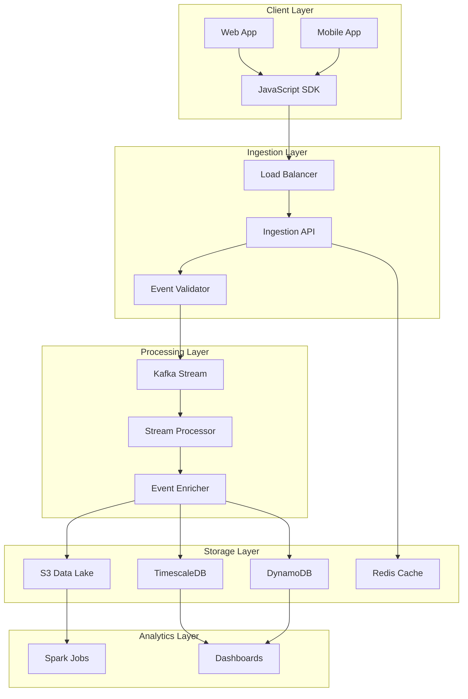

# Developer Getting Started Guide

Welcome to the User Behavior Data Pipeline! This guide will help you get up and running with our analytics infrastructure in your development environment.

## Table of Contents

1. [Prerequisites](#prerequisites)
2. [Quick Start](#quick-start)
3. [Local Development Setup](#local-development-setup)
4. [Architecture Overview](#architecture-overview)
5. [Development Workflow](#development-workflow)
6. [Testing](#testing)
7. [Debugging](#debugging)
8. [Common Tasks](#common-tasks)
9. [Troubleshooting](#troubleshooting)

## Prerequisites

Before you begin, ensure you have the following installed:

### Required Software

- **Docker** (v24.0+) and Docker Compose (v2.20+)
- **Node.js** (v20 LTS) and npm (v10+)
- **Python** (v3.11+) and pip
- **AWS CLI** (v2.13+)
- **Terraform** (v1.5+)
- **Git** (v2.40+)

### Optional but Recommended

- **VS Code** with recommended extensions
- **Postman** or similar API testing tool
- **k9s** for Kubernetes management
- **aws-vault** for AWS credential management

### Access Requirements

- GitHub repository access
- AWS account with appropriate IAM permissions
- Access to shared development resources (S3 buckets, DynamoDB tables)
- VPN access (if required by your organization)

## Quick Start

Get the data pipeline running locally in under 5 minutes:

```bash
# Clone the repository
git clone https://github.com/company/user-behavior-pipeline.git
cd user-behavior-pipeline

# Copy environment template
cp .env.example .env

# Start the development environment
docker-compose up -d

# Verify services are running
docker-compose ps

# Run initial setup
./scripts/dev-setup.sh

# Send a test event
curl -X POST http://localhost:8080/v1/events \
  -H "Content-Type: application/json" \
  -H "X-API-Key: dev-api-key" \
  -d '{
    "event_type": "page_view",
    "event_timestamp": "'$(date -u +%Y-%m-%dT%H:%M:%S.000Z)'",
    "session_id": "test-session-123",
    "page": {
      "url": "http://localhost:3000/test",
      "title": "Test Page"
    }
  }'
```

## Local Development Setup

### 1. Repository Structure

```
user-behavior-pipeline/
├── services/               # Microservices
│   ├── ingestion/         # Event ingestion API
│   ├── processor/         # Stream processor
│   └── aggregator/        # Real-time aggregation
├── lambdas/               # Lambda functions
│   ├── event-validator/
│   ├── enricher/
│   └── alerting/
├── infrastructure/        # IaC definitions
│   ├── terraform/
│   └── kubernetes/
├── sdk/                   # Client SDKs
│   ├── javascript/
│   ├── python/
│   └── java/
├── scripts/              # Utility scripts
├── tests/                # Test suites
└── docs/                 # Documentation
```

### 2. Environment Configuration

Create a `.env` file in the project root:

```bash
# Development Environment Configuration
ENVIRONMENT=development
AWS_REGION=us-east-1
AWS_PROFILE=dev

# Local Services
API_PORT=8080
PROCESSOR_PORT=8081
METRICS_PORT=9090

# Local Kafka
KAFKA_BOOTSTRAP_SERVERS=localhost:9092
KAFKA_TOPIC_EVENTS=user-events-dev
KAFKA_CONSUMER_GROUP=processor-dev

# Local Storage
S3_BUCKET=company-events-dev
DYNAMODB_TABLE=real-time-events-dev
REDIS_URL=redis://localhost:6379

# Development Credentials
DEV_API_KEY=dev-api-key
DEV_SECRET_KEY=dev-secret-key

# Feature Flags
ENABLE_DEBUG=true
ENABLE_PROFILING=true
SAMPLE_RATE=1.0
```

### 3. Docker Compose Services

Our `docker-compose.yml` provides the complete local stack:

```yaml
version: '3.8'

services:
  # API Gateway
  api:
    build: ./services/ingestion
    ports:
      - "8080:8080"
    environment:
      - ENV=development
    volumes:
      - ./services/ingestion:/app
    depends_on:
      - kafka
      - redis

  # Kafka Message Broker
  kafka:
    image: confluentinc/cp-kafka:7.5.0
    ports:
      - "9092:9092"
    environment:
      KAFKA_ZOOKEEPER_CONNECT: zookeeper:2181
      KAFKA_ADVERTISED_LISTENERS: PLAINTEXT://localhost:9092

  # Stream Processor
  processor:
    build: ./services/processor
    environment:
      - KAFKA_BOOTSTRAP_SERVERS=kafka:9092
    depends_on:
      - kafka
      - postgres

  # Time-series Database
  postgres:
    image: timescale/timescaledb:latest-pg15
    ports:
      - "5432:5432"
    environment:
      POSTGRES_PASSWORD: devpassword
    volumes:
      - postgres_data:/var/lib/postgresql/data

  # Redis Cache
  redis:
    image: redis:7-alpine
    ports:
      - "6379:6379"

  # LocalStack for AWS Services
  localstack:
    image: localstack/localstack:3.0
    ports:
      - "4566:4566"
    environment:
      - SERVICES=s3,dynamodb,kinesis,lambda
      - DEFAULT_REGION=us-east-1
    volumes:
      - "./scripts/localstack:/etc/localstack/init/ready.d"

volumes:
  postgres_data:
```

### 4. Local AWS Services Setup

Initialize LocalStack with development resources:

```bash
# Create S3 buckets
aws --endpoint-url=http://localhost:4566 s3 mb s3://company-events-dev
aws --endpoint-url=http://localhost:4566 s3 mb s3://company-processed-dev

# Create DynamoDB tables
aws --endpoint-url=http://localhost:4566 dynamodb create-table \
  --table-name real-time-events-dev \
  --attribute-definitions \
    AttributeName=user_id,AttributeType=S \
    AttributeName=timestamp,AttributeType=N \
  --key-schema \
    AttributeName=user_id,KeyType=HASH \
    AttributeName=timestamp,KeyType=RANGE \
  --billing-mode PAY_PER_REQUEST

# Create Kinesis stream
aws --endpoint-url=http://localhost:4566 kinesis create-stream \
  --stream-name user-events-dev \
  --shard-count 2
```

## Architecture Overview

### System Components



### Data Flow

1. **Event Collection**: Client SDKs collect user behavior events
2. **Ingestion**: API validates and accepts events
3. **Streaming**: Events flow through Kafka for real-time processing
4. **Enrichment**: Add context like geo-location, device info
5. **Storage**: Events stored in multiple systems based on use case
6. **Analytics**: Batch and real-time analytics on stored data

## Development Workflow

### 1. Feature Development

```bash
# Create feature branch
git checkout -b feature/add-new-event-type

# Start development environment
docker-compose up -d

# Watch logs
docker-compose logs -f api processor

# Make changes and test
# ... edit code ...

# Run tests
npm test
pytest tests/

# Commit changes
git add .
git commit -m "feat: add custom event type support"
```

### 2. Testing Your Changes

```bash
# Unit tests
npm run test:unit

# Integration tests
npm run test:integration

# End-to-end tests
npm run test:e2e

# Load testing
npm run test:load
```

### 3. Code Quality Checks

```bash
# Linting
npm run lint
python -m flake8 services/

# Type checking
npm run typecheck
mypy services/

# Security scanning
npm audit
bandit -r services/

# Code formatting
npm run format
black services/
```

## Testing

### Unit Testing

Example test for event validator:

```javascript
// tests/unit/validator.test.js
describe('EventValidator', () => {
  test('should validate page_view event', () => {
    const event = {
      event_type: 'page_view',
      event_timestamp: new Date().toISOString(),
      session_id: 'test-123',
      page: {
        url: 'https://example.com',
        title: 'Test Page'
      }
    };
    
    const result = validator.validate(event);
    expect(result.valid).toBe(true);
  });
  
  test('should reject invalid timestamp', () => {
    const event = {
      event_type: 'page_view',
      event_timestamp: 'invalid-date',
      session_id: 'test-123'
    };
    
    const result = validator.validate(event);
    expect(result.valid).toBe(false);
    expect(result.errors).toContain('Invalid timestamp format');
  });
});
```

### Integration Testing

```python
# tests/integration/test_pipeline.py
import pytest
from kafka import KafkaProducer, KafkaConsumer
import json

@pytest.fixture
def kafka_producer():
    return KafkaProducer(
        bootstrap_servers=['localhost:9092'],
        value_serializer=lambda v: json.dumps(v).encode('utf-8')
    )

def test_event_pipeline_flow(kafka_producer):
    # Send test event
    test_event = {
        'event_type': 'test_event',
        'event_timestamp': '2024-01-15T10:00:00Z',
        'session_id': 'test-session'
    }
    
    kafka_producer.send('user-events-dev', test_event)
    kafka_producer.flush()
    
    # Verify event was processed
    consumer = KafkaConsumer(
        'processed-events-dev',
        bootstrap_servers=['localhost:9092'],
        auto_offset_reset='latest',
        consumer_timeout_ms=5000
    )
    
    processed = False
    for message in consumer:
        event = json.loads(message.value)
        if event['session_id'] == 'test-session':
            processed = True
            assert 'enriched_data' in event
            break
    
    assert processed, "Event was not processed within timeout"
```

### Load Testing

```javascript
// tests/load/spike-test.js
import http from 'k6/http';
import { check, sleep } from 'k6';

export const options = {
  stages: [
    { duration: '30s', target: 100 },  // Ramp up
    { duration: '1m', target: 100 },   // Stay at 100
    { duration: '30s', target: 1000 }, // Spike to 1000
    { duration: '1m', target: 1000 },  // Stay at 1000
    { duration: '30s', target: 100 },  // Scale down
  ],
  thresholds: {
    http_req_failed: ['rate<0.1'], // Error rate under 10%
    http_req_duration: ['p(95)<200'], // 95% of requests under 200ms
  },
};

export default function () {
  const payload = JSON.stringify({
    event_type: 'page_view',
    event_timestamp: new Date().toISOString(),
    session_id: `test-${__VU}-${__ITER}`,
    page: {
      url: 'https://example.com/test',
      title: 'Load Test Page'
    }
  });

  const params = {
    headers: {
      'Content-Type': 'application/json',
      'X-API-Key': 'dev-api-key',
    },
  };

  const res = http.post('http://localhost:8080/v1/events', payload, params);
  
  check(res, {
    'status is 200': (r) => r.status === 200,
    'response has event_id': (r) => JSON.parse(r.body).event_id !== undefined,
  });
  
  sleep(1);
}
```

## Debugging

### 1. Debug Mode

Enable debug mode in your `.env`:

```bash
ENABLE_DEBUG=true
LOG_LEVEL=debug
```

### 2. Debugging with VS Code

`.vscode/launch.json`:

```json
{
  "version": "0.2.0",
  "configurations": [
    {
      "type": "node",
      "request": "attach",
      "name": "Attach to API",
      "port": 9229,
      "remoteRoot": "/app",
      "localRoot": "${workspaceFolder}/services/ingestion",
      "skipFiles": ["<node_internals>/**"]
    },
    {
      "name": "Python: Remote Attach",
      "type": "python",
      "request": "attach",
      "connect": {
        "host": "localhost",
        "port": 5678
      },
      "pathMappings": [
        {
          "localRoot": "${workspaceFolder}/services/processor",
          "remoteRoot": "/app"
        }
      ]
    }
  ]
}
```

### 3. Distributed Tracing

View traces in Jaeger UI:
- Open http://localhost:16686
- Select service: `ingestion-api`
- View request flow through all components

### 4. Log Aggregation

```bash
# View all logs
docker-compose logs -f

# Filter by service
docker-compose logs -f api processor

# Search logs
docker-compose logs | grep ERROR

# Export logs
docker-compose logs > debug.log
```

## Common Tasks

### 1. Adding a New Event Type

```bash
# 1. Define schema
cat > schemas/events/user_feedback.json << EOF
{
  "type": "object",
  "properties": {
    "event_type": { "const": "user_feedback" },
    "rating": { "type": "number", "minimum": 1, "maximum": 5 },
    "comment": { "type": "string", "maxLength": 1000 }
  },
  "required": ["event_type", "rating"]
}
EOF

# 2. Update validator
npm run generate-validators

# 3. Add processor logic
# Edit services/processor/handlers/user_feedback.py

# 4. Update tests
# Add test cases for new event type

# 5. Deploy changes
./scripts/deploy-dev.sh
```

### 2. Running Database Migrations

```bash
# Generate migration
npm run migration:generate -- --name add_user_feedback_table

# Run migrations
npm run migration:up

# Rollback if needed
npm run migration:down
```

### 3. Updating Dependencies

```bash
# JavaScript
npm update
npm audit fix

# Python
pip-compile requirements.in
pip install -r requirements.txt

# Docker images
docker-compose pull
docker-compose build --no-cache
```

### 4. Performance Profiling

```bash
# Enable profiling
export ENABLE_PROFILING=true

# Start with profiler
node --inspect services/ingestion/index.js

# Python profiling
python -m cProfile -o profile.stats services/processor/main.py

# Analyze results
snakeviz profile.stats
```

## Troubleshooting

### Common Issues

#### 1. Kafka Connection Failed

```bash
# Check Kafka is running
docker-compose ps kafka

# Test connection
docker-compose exec kafka kafka-topics --bootstrap-server localhost:9092 --list

# Reset Kafka state
docker-compose down -v
docker-compose up -d kafka zookeeper
```

#### 2. LocalStack Services Not Available

```bash
# Check LocalStack health
curl http://localhost:4566/_localstack/health

# Restart LocalStack
docker-compose restart localstack

# Verify services
aws --endpoint-url=http://localhost:4566 s3 ls
```

#### 3. High Memory Usage

```bash
# Check container resources
docker stats

# Increase memory limits in docker-compose.yml
services:
  processor:
    mem_limit: 2g
    memswap_limit: 2g
```

#### 4. Event Processing Lag

```bash
# Check consumer lag
docker-compose exec kafka kafka-consumer-groups \
  --bootstrap-server localhost:9092 \
  --group processor-dev \
  --describe

# Scale up processors
docker-compose up -d --scale processor=3
```

### Debug Checklist

When something goes wrong:

1. **Check service health**
   ```bash
   curl http://localhost:8080/health
   ```

2. **Review logs**
   ```bash
   docker-compose logs --tail=100 api
   ```

3. **Verify configurations**
   ```bash
   docker-compose config
   ```

4. **Test connectivity**
   ```bash
   docker-compose exec api ping kafka
   ```

5. **Check resource usage**
   ```bash
   docker system df
   df -h
   ```

### Getting Help

- **Documentation**: `/docs` directory
- **Slack Channel**: #data-pipeline-dev
- **Issue Tracker**: GitHub Issues
- **Team Lead**: @data-platform-team

## Next Steps

1. **Explore the Codebase**: Familiarize yourself with service implementations
2. **Run Tests**: Ensure all tests pass in your environment
3. **Try the SDK**: Integrate the JavaScript SDK in a sample app
4. **Join Stand-ups**: Daily at 10 AM for team sync
5. **Read Architecture Docs**: Deep dive into system design decisions

Happy coding! 🚀